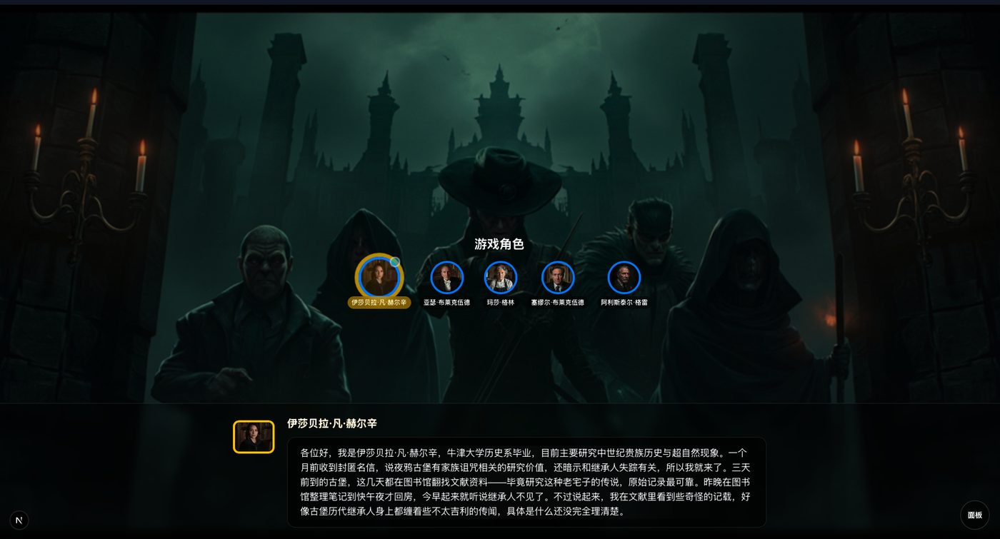
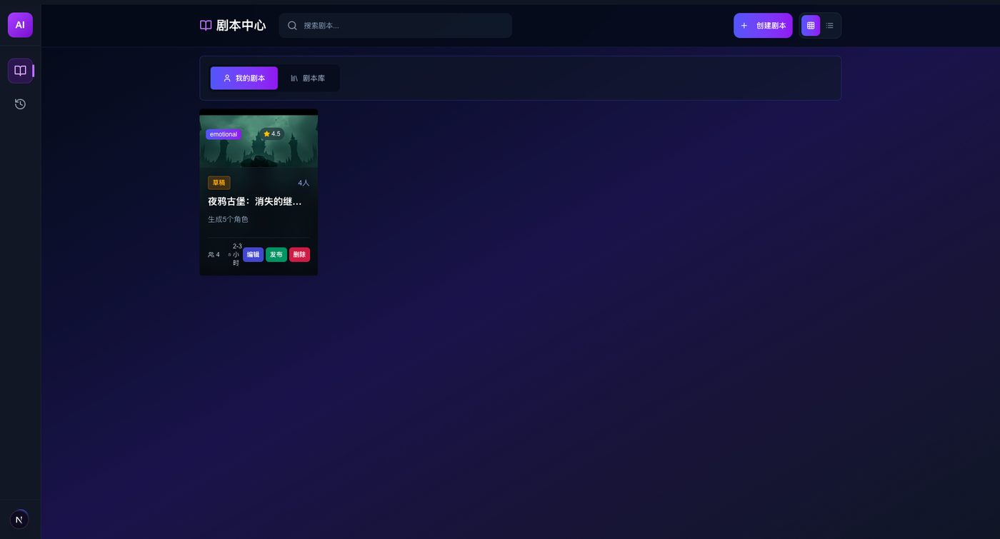
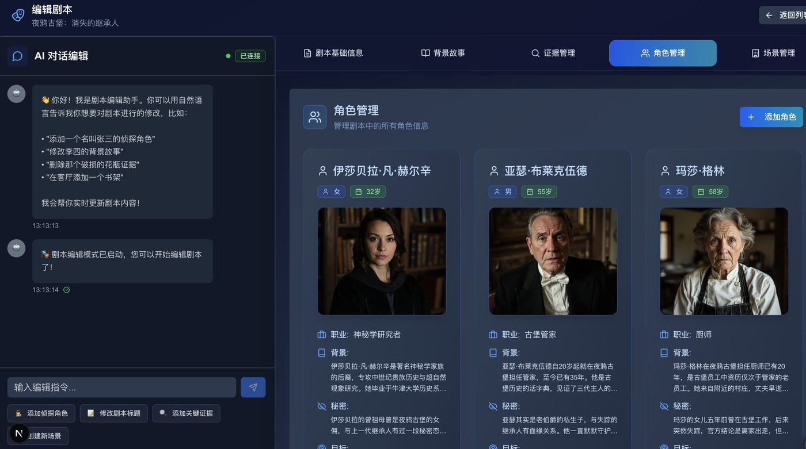
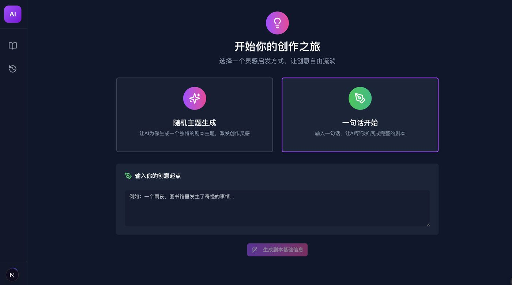

# 🎭 人生海海

面向手机浏览器的单真人 AI 剧本杀：玩家选择一个角色，其余 3–7 名角色由 AI 演绎。
FastAPI 单体（前端界面当前已移除，待重建）。**规则引擎是阶段、搜证、证据可见性和投票的唯一权威；
云模型只生成角色候选发言，不能直接修改游戏状态。**

[English Version](README_EN.md) ｜ [历史进度记录](CHANGELOG.md)

## 现在是什么状态

> 更新：2026-09-12

| 能力 | 状态 |
| --- | --- |
| 本机开发运行 | ✅ 可用。见[从零搭建环境](docs/development/LOCAL_SETUP_FROM_SCRATCH.md) |
| 单真人 + AI 文字整局 | ⚠️ 可玩，但内容尚未导入发布 |
| 登录（手机验证码） | ⚠️ 代码就绪，**未接真实短信供应商**，暂不能上线 |
| 开发期免登录 | ✅ `ALLOW_ANONYMOUS_ACCESS=true` 即可直接进游戏 |
| 语音输入 / TTS | ⏸ 未接通 |
| 正式上线 | ❌ 未就绪。`runtime_ready=false` |

**不能上线的原因**：真实短信供应商尚未接入。生产环境启动自检会因此拒绝启动——
这是刻意的，宁可起不来也不要带着模拟验证码对外开放。

## 快速开始

第一次开发请照着[从零搭建本机环境](docs/development/LOCAL_SETUP_FROM_SCRATCH.md)做，
它不需要 Docker、也不需要管理员密码。已有 `.env` 不要覆盖。

装好之后：

```bash
backend/.venv/bin/python scripts/local_postgres.py start
backend/.venv/bin/python scripts/local_redis.py start
cd backend && ./.venv/bin/python -B main.py        # 后端 127.0.0.1:8010
```

后端 API 地址 <http://127.0.0.1:8010>。前端界面已移除待重建，重建后再接入浏览器。

> 当前仓库不含任何可玩的剧本正文（商业剧本受版权保护，不得入库）。
> 开发者可用 `backend/scripts/seed_demo_package.py` 导入一份虚构示例剧本：
>
> ```bash
> # 需要 .env 里配置好 DASHSCOPE_API_KEY 与定价变量，会产生少量云模型费用
> backend/.venv/bin/python backend/scripts/seed_demo_package.py --allow-paid
> ```
> 脚本会走完整真实链路（编译 → 模型审核 → 人工审核 → 审批 → 发布），
> 完成后 `/play` 即能看到这份演示剧本。仅限开发环境，生产环境会拒绝执行。

## 文档从哪看

| 想知道什么 | 看这里 |
| --- | --- |
| 怎么把环境装起来 | [从零搭建本机环境](docs/development/LOCAL_SETUP_FROM_SCRATCH.md) |
| 装好之后怎么用 | [小白本地启动说明](docs/development/LOCAL_DEVELOPMENT.md) |
| 怎么参与贡献 | [贡献指南](CONTRIBUTING.md) |
| 接下来要做什么 | [迭代方案](迭代方案.md) |
| 验收标准 | [验收清单](docs/development/ACCEPTANCE.md) |
| 以前发生过什么 | [变更记录](CHANGELOG.md) |
| 部署 | [ECS 部署](deploy/ECS.md) |

`docs/development/` 下另有 78 篇按里程碑归档的开发记录，用于追溯具体决策，
不必通读。

## 安全约定

以下几条由启动自检强制，配置不合格时生产环境会**拒绝启动**而不是带病运行：

- `SECRET_KEY` 必须显式设置且足够长——源码里的默认值已公开，等同于没有钥匙。
- 生产环境不接受模拟短信、匿名访问、弱数据库口令和对象存储出厂凭据。
- 访问令牌默认 2 小时，可挂失；登录与验证码均有频次限制。
- 接口说明书（`/docs`）与遗留管理接口在生产环境默认不注册。

---

## 上游功能介绍（历史）

> 以下内容来自上游项目，描述的是**曾经实现过或计划中的能力**，
> 不能当作当前真人模式已完成的证明。当前实际状态以上面的表格为准。
> 两段旧的安装说明已删除——它们与上面的「快速开始」冲突，且仍在讲
> Docker compose 与 OPENAI_API_KEY，照做装不起来。

## 🌟 项目特色

- 🤖 **一名真人 + AI 配角** - 真人可选择包括凶手在内的角色，其他角色由 AI 补齐
- 🎯 **完整游戏流程** - 包含背景介绍、自我介绍、搜证、调查、讨论、投票、揭晓真相等完整阶段
- 🌐 **实时同步体验** - 使用WebSocket实现实时游戏状态同步
- 💻 **现代化界面** - 响应式Web界面，支持移动端访问
- 🧠 **智能推理引擎** - 基于大语言模型的AI推理能力
- 🔐 **权限隔离** - 私本、凶手秘密、证据和系统真相按角色过滤
- 💾 **事件恢复** - 阶段、行动、消息和模型用量持久化，支持断线继续
- ✏️ **AI剧本编辑** - 支持AI生成和编辑剧本内容

## 📸 屏幕截图

<div style="display: flex; flex-direction: column; gap: 20px;">
  <div style="display: flex; justify-content: space-between; gap: 20px;">
    
    
  </div>
  <div style="display: flex; justify-content: space-between; gap: 20px;">
    
    
  </div>
</div>

## 🚀 核心功能

### AI剧本生成与编辑
- 自动生成完整剧本杀内容，包括背景故事、角色设定、证据设计和场景描述
- 支持自然语言指令编辑剧本，如"添加一个善良的角色"或"修改凶手的动机"
- 可以随时调整剧本内容，AI会自动适应修改并保持逻辑一致性

### AI剧情推演
- 旧模式支持全AI模拟；当前MVP是一名真人＋其余AI角色，使用/play
- 8个游戏阶段：背景介绍、自我介绍、搜证、调查取证、自由讨论、投票表决、真相揭晓、游戏结束
- 每个AI角色都有独特性格和秘密，能够进行自然对话和推理

### TTS语音合成

- MiniMax API: 支持多种语言和声音
- [CosyVoice 2.0](https://github.com/journey-ad/CosyVoice2-Ex): 本地部署的中文语音合成服务

### 文生图服务
支持多种图像生成服务：
- ComfyUI: 本地部署的稳定扩散图像生成平台
- MiniMax API: 云端图像生成服务

### 大语言模型(LLM)支持

当前 Fusion 角色链路只接受经过白名单和离线契约测试的火山方舟或阿里百炼配置，不能把“OpenAI 兼容”理解为可任意更换供应商。默认使用火山方舟 Character；切换百炼只能新开一局并显式选择，不能在失败后自动发送到另一家。


## 📁 项目结构

```
jubensha/
├── backend/     # 后端服务
│   ├── src/     # 核心源码
│   ├── docs/    # 文档资料
│   └── tests/   # 测试代码
```

## 🎮 游戏流程

1. **背景介绍阶段** - 系统叙述案件背景故事
2. **自我介绍阶段** - AI角色依次介绍自己的身份背景
3. **搜证阶段** - AI角色搜查场景发现证据
4. **调查取证阶段** - AI角色互相提问推进调查
5. **自由讨论阶段** - AI角色分享推理和反驳观点
6. **投票表决阶段** - AI角色投票指认凶手
7. **真相揭晓阶段** - 公布案件真相和游戏结果

## 🛠 技术架构

### 后端技术栈
- **FastAPI** - 现代、快速(高性能)的Web框架
- **LangChain** - 构建AI应用的框架
- **OpenAI/兼容模型** - 大语言模型支持
- **PostgreSQL** - 关系型数据库
- **WebSocket** - 实时双向通信
- **MinIO** - 对象存储服务

## 📝 开发计划

未来的优化方向包括：

### 剧本生成和编辑功能
- 增强AI剧本生成能力，支持更复杂的剧情结构
- 优化剧本编辑体验，提供更直观的编辑界面
- 支持更多类型的剧本模板和自定义选项
- 提升AI对剧本逻辑一致性的维护能力

### UI交互优化
- 改进用户界面设计，提升用户体验
- 优化移动端适配和交互效果
- 增强游戏过程中的可视化反馈
- 提供更流畅的操作流程和动画效果

### 多语言支持
- 支持国际化和多语言切换
- 支持中英文等多语言界面

## 📄 许可证

本项目采用 MIT 许可证 - 参见 [LICENSE](LICENSE) 文件了解详细信息。
您可以自由地：
- 使用本软件用于商业目的
- 修改和分发本软件
- 在您的项目中使用本软件的部分或全部代码

## 🤝 贡献

欢迎提交Issue和Pull Request来改进项目。
